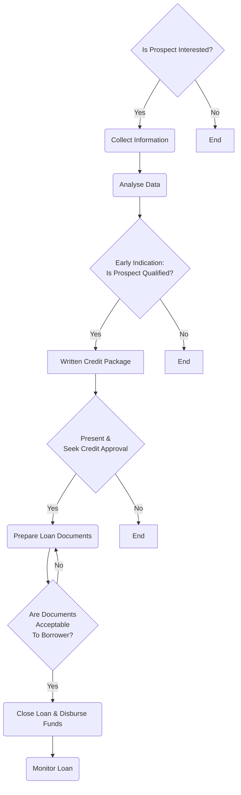

![[Pasted image 20240817115845.png|500]]

## Chapter 1 - The Business of Banking
At its core, banking is about two things -- (1) **building relationships** and (2) **managing risk**.

Overview of some types of risks that banks must manage:

| Type of Risk | Description                                                                                                                                                            |
| ------------ | ---------------------------------------------------------------------------------------------------------------------------------------------------------------------- |
| Credit       | - The risk that borrowers won't repay their loans as agreed. - This is the big one that has caused many banks to fail.                                              |
| Operational  | The risk that a bank's systems or processes would fail, thus impacting both customers and employees as the bank would not be able to deliver its products or services. |
| Reputational | The risk of damage done by adverse public opinion.                                                                                                                     |
| Legal        | The risk of incurring penalties and fines arising from litigation.                                                                                                     |
| Market       | The risk of interest rate fluctuations impacting the bank's profitability.                                                                                             |
| Regularotry  | The risk of being fined, penalised, or shut down by not adhering to rules and laws the various bodies that oversee banks have established.                             |
Banks make money primarily two ways:
1. **Interest rate spread** - Buying low and selling high.
2. **Fee income** - Including [[Origination Fees|origination fees]], annual fees, waiver fees, and product fees.

A practice called **"fractional-reserve banking"** allows banks to lend out far more money than they actually have in customer deposits.

## Chapter 2 - Why Do Businesses Borrow Money
1. **Capital Expenditures (CapEx)**
	- Equipment is expensive and has a useful life of many years, so businesses like to borrow money from their bank to finance these purchases.
	- CapEx are best financed by *term loans* - all the funds needed for the purchase are disbursed to the borrower at the time of the purchase and are expected to be paid back in monthly instalments.
2. **Real Estate Purchases**
3. **Working Capital (Line of Credit)**
	- The commercial banking equivalent of personal credit card is a *"working capital line of credit"*.
	- An example of a very common need for a business to use its line of credit is to **"finance Accounts Receivable"**.
		- That is, the business <mark style="background: #FFF3A3A6;">borrows money from its bank to pay its suppliers ("Accounts Payable") and pays the line of credit down as soon as its Accounts Receivable are collected</mark>.
		- The three accounts described (Inventory, Accounts Receivable, and Accounts Payable) are often called the *"working capital accounts"* on a company's balance sheet. This is why the type of loan businesses use to finance them is called a working capital line of credit.
4. **Start-ups**
5. **Business Acquisitions**
6. **Owner Buyouts**
	- In such cases, a company wishes to buy out the ownership interest of one of the principals of the business. 
	- However, the company is not likely to have enough cash on hand to finance the proposed buyout, so the business would approach its bank with a borrowing request for the transaction.
	- Bankers refer to this as *restructuring the balance sheet (recapitalisation)*.
		- After the transaction, the company's balance sheet is weaker (more debt, less equity), but the principal now has additional cash in his pocket, and the buyers (new principals) now own a greater share of the business.
7. **[[Bridge Loans]]**
8. **Funding Losses**

>[!info] Remember, only **CASH** repays loans.

## Chapter 3 - The Art of Underwriting

>[!info]- Origin of the name "Underwriting"
>As the story goes, insurers in the past would list all known risks on one side of a piece of paper with the mitigating factors on the other side. If they were willing to accept the risks in exchange for a given premium, they would *write* their names *under* the list of risks -- hence the term "underwriting".

[[Underwriting]] is the process of deciding whether to lend money to a company after assessing the known risks.

### Six C's of Credit
This helpful tool has been used for generations to remind credit professionals of the six most important factors to consider when lending money.

| No  | Six C's of Credit | Description                                                                                                                             |
| --- | ----------------- | --------------------------------------------------------------------------------------------------------------------------------------- |
| 1   | **Conditions**    | - Qualitative factors impacting a borrower's financial performance. - Do the borrower's non-financial indicators predict success?    |
| 2   | **Character**     | - Borrower's intent and willingness to honour the loan agreement. - Do you trust your borrower?                                      |
| 3   | **Capital**       | - Borrower's equity or willingness to share in the risk. - Does the borrower have "skin in the game"?                                |
| 4   | **Capacity**      | - Sufficiency of borrower's cash flow to service its obligations. - Are teh borrower's coverage ratios acceptable?                   |
| 5   | **Collateral**    | - Banks' backup plan if borrower cannot repay its loan. - Will the borrower pledge its assets to make the bank whole?                |
| 6   | **Competition**   | - Banks must be disciplined and guard against over-aggression. - What are other structure banks in the market offering to customers? |
### Questions to Consider
1. **What For?**
2. **Will You Pay Me Now or Pay Me Later?**
3. **What's Your Plan?**
	- *"How do you plan to pay me back?"*
	- We would want to know where the money will come from. Bankers call this the **"primary source of repayment" (PSOR)**.
4. **Long Distance Relationships**
	- When the borrower is located physically far away from the bank, we call this lending as **"out of market"**, and it poses additional risk.
5. **His Word is His Bond**

### Qualitative Analysis
1. **Industry Considerations**
2. **The Business Life Cycle**
3. **Quality of Management**
	- A terrific company with mediocre management may soon be in trouble, but an average business led by talented and experienced people will eventually thrive.

### Quantitative Analysis
1. **Balance Sheet Analysis**
	- Banks want their borrowers to have *some leverage* -- if no one is borrowing, banks go out of business.
	- But many banks learned a painful lesson in 2008 -- if you allow people to borrow 95% of the value of their homes (leverage ratio of 19:1), bad things can happen for both the bank and borrower. The same rules apply in commercial lending.
2. **Income Statement Analysis**
3. **Debt Service and Fixed Charge Coverage**
	- [[Debt-Service Coverage Ratio (DSCR)]] measures a firm's available cash flow to pay its current debt obligations.
	- [[Fixed Charge Coverage Ratio (FCCR)]] measures a company's ability to meet fixed charges from its earnings before interest and taxes (EBIT).

## Chapter 4 - Loan Structuring: Improving Your Odds
Loans must be properly *structured*. This means that the loan should have characteristics appropriate to the borrowing purpose. These characteristics include:
1. **[[Facility Type]]** - Type of loan
2. **[[Tenor & Amortisation]]** - Repayment period
3. **[[Loan Pricing]]**
4. **[[Risk Mitigation]]**

## Chapter 5 - Getting the "Thumbs Up" - The Credit Approval Process
In reality, the underwriting and the structuring of a loan happen somewhat concurrently.
- For example, if the underwriting analyst suggests that we are heading toward a positive decision, then we immediately begin thinking about what the elements of the loan would look like. If our quantitative analysis reveals that the borrower has weak cash flow, our structure would likely include a covenant related to cash flow. If the company doesn't have much capital, our structure might require the personal guarantee of the company's owner.
- Our through process would sound like -- *"We can approve a loan to this borrower, but it would have to include these specific structural elements"*.

Most banks use some type of template to summarise all of the pertinent information needed to make a credit decision. The end result of the underwriting and structuring process is a document that contains:
1. The borrower's legal name, address, and company background.
2. A summary of how much credit exposure the bank would have to the borrower if the loan(s) were approved.
3. The types of loan facilities being requested and the dollar amount of each.
4. The borrower's risk rating and classification.
5. Our written narrative highlighting the risks associated with lending to this borrower and our proposed structure to mitigate those risks.

## Chapter 6 - Shifting to Monitoring Mode
Where consumer lending is more transactional, commercial lending is more *relationship-oriented*, which means keeping in touch is paramount for both the bank and its customers.

For this reason, most banks review each of their commercial relationships regularly.
- Aside from satisfying regulatory requirements, this is also a sound *risk management* practice.
- It allows bankers to reconnect with their customers and to get a sense of how things are going in the business.
- Specifically, an annual review should include:
	1. A face-to-face meeting between the banker(s) and the management of the company, ideally at the customer's place of business.
	2. The collection of current financial statements.
	3. A review of any significant changes since the last meeting.
	4. Creation of a written summary to document the review.

### Appraisals
An appraisal is an **assessment of the fair market value** of a property, business, antique, or even a collectible. 
- Appraisals are used to **estimate the value of items** which are infrequently traded and are often rare or unique.
- Appraisals are helpful tools when monitoring existing loans.

### Field Exams
As with *fixed assets*, we may want to check in periodically to determine the current value of this *"self-liquidating collateral"*. 
- Is the company's inventory readily sellable, or is part of it now obsolete? Are all of the accounts receivable collectible, or are some of these IOUs stale and not likely to ever be received by your customer?

The simplest way to learn this is to conduct a **"field example" (collateral audit)**.
- This involves sending someone from the bank to spend a few days with our customer at their place of business, examining their accounts receivable and counting their inventory.

### Covenant Compliance
The process consists of the following steps:
1. **Tracking receipt of the customer's financial statements** - The most basic requirement in any loan agreement is that the customer must submit fiscal year-end statements in a timely manner. It also often requires submission of YTD (interim) statements monthly or quarterly.
2. **Tracking receipt of the borrower's covenant compliance certificate** - This short document, created by the customer, lists each covenant and shows whether the customer was in compliance as of the specified date.
3. **Calculating to confirm compliance** - We should always trust, but verify the calculations submitted by the borrower.

### Portfolio Metrics
Since banks are in the business of managing risk rather than avoiding risk, they know that some of the loans made will not be repaid as agreed. In fact, the bank that has absolutely no problem loans is not taking enough risk.
- However, banks certainly want to *minimise the number of high risk and problem loans*. To do this, banks must have a way to measure the risk of each loan as well as the risk of the entire loan portfolio.
- *Banking regulatory agencies* also keep a close eye on how much risk banks are taking in their commercial lending activities. And since bank stocks are *publicly traded*, investors want to know they are investing in a bank that can measure and accurately report its credit quality.

One methodology banking regulators and banks use is to categorise loans into one of the following classifications (from best to worst).
1. **Pass**
2. **Watch** (not an official classification, but used by banks to identify loans on the *lowest end of the Pass spectrum*)
3. **Special Mention** (also called **Other Loans Especially Mentioned (OLEM)**)
4. **Substandard**
5. **Doubtful**
6. **Loss**
Loans in any of the 4 bottom categories (*Special Mention or worse*) are called **"Criticised Assets"**, and those that are *Substandard or worse* are referred to as **"Classified**.

### Expected Loss
Expected loss is used as a key metric for performing categorisation of portfolio metrics. The greater the expected loss, the further down the classification list.

**Probability of default** is the risk that a borrower will be unable to or unwilling to repay its debt as agreed. This refers to the primary source of repayment of the loan.
**Loss given default** is the financial loss a bank suffers when a borrower does not repay. This is based on the outstanding balance of the loan and the collateral as a backup source of repayment.
- For example, even if a borrower has terribly weak cash flow, the bank's expected loss will be minimal if the loan has only two monthly payments remaining or if the bank is holding cash collateral to support the loan.

$$
\text{Expected Loss (EL)} = \text{Probability of Default (PD)} \times \text{Loss Given Default (LGD)}
$$

>[!info] Downgrading loans
>As a bank recognises that an existing loan is deteriorating, it acknowledges that its expected loss on that loan is increasing. To be proactive, the bank should immediately *reclassify the loan* to accurately reflect its larger expected loss. This process is called **"downgrading" the loan**.
>
>Not only do downgrades given the credit officers a headache, but they also require the bank to set aside more money as a **"provision for credit losses"**. That is, banks do not wait until a borrower actually defaults on a loan to take a loss on that loan. Rather, the bank takes its medicine right away by setting aside more capital to compensate for the expected loss. 
>- This provision is an *expense* on a bank's income statement, so the larger it gets, the greater the negative impact on the bank's earnings.

### Performing Assets
We would only consider our assets to be "performing" when they are doing what we want them to do -- make us money.

Banks earn money when their assets -- loans -- are performing, or earning interest. Even if principal is repaid as agreed, the bank will lose money if its borrowers are not also making interest payments on their loans.
- In cases where the borrower has a defined weakness (e.g., consecutive years of operating losses), it would likely be classified as Substandard. And when things get bad enough on a Substandard loan that the bank has serious doubts whether it will even recover its principal, then *the accounting for the loan changes*.
- In these situations, when the borrower sends its monthly payment (consisting of principal and interest), the bank **applies the entire amount to reducing the principal balance**. That is, the bank (internally) tries to *accelerate the repayment* by applying even the interest being paid to the principal balance.
- In the eyes of the bank, the loan is no longer earning interest -- it has *stopped "performing"*.

When the expected loss on a loan is high enough and things are really going downhill, the bank internally labels the loan as a **"nonperforming asset" (NPA)**.

## Chapter 7 - A Complex Lending Machine
Various key departments in a bank:

| No  | Department                   | Description                          |
| --- | ---------------------------- | ------------------------------------ |
| 1   | Credit                       | Approving the risks.                 |
| 2   | Lending                      | Winning new customers.               |
| 3   | Commercial Real Estate (CRE) | Financing bricks and sticks.         |
| 4   | Leasing                      | Financing heavy equipment.           |
| 5   | Collateral Services          | Trusting but verifying.              |
| 6   | Private Banking              | Wooing the wealthy.                  |
| 7   | Special Loans                | Rehabilitating the wounded (assets). |
| 8   | Loan Review                  | Checking and reporting.              |
| 9   | Treasury Management          | Generating fee income.               |
| 10  | Legal                        | Defending and protecting.            |
| 11  | Regulators                   | Looking over your shoulder.          |
## Chapter 8 - A Day In The Life
